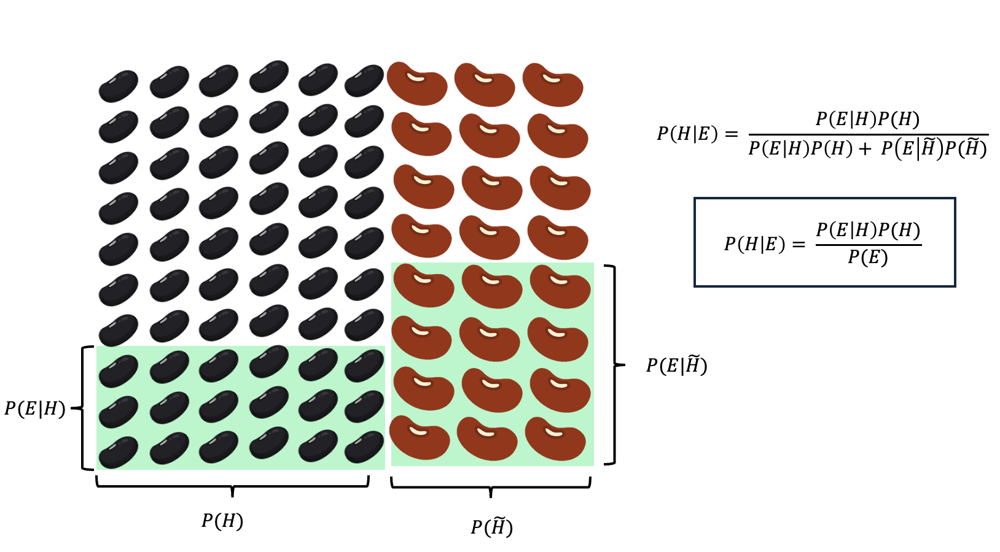

```{r setup, include=FALSE}
knitr::opts_chunk$set(echo = TRUE)
library(dplyr)
library(tidyverse)
library(ggplot2)
library(R.utils)

```

## Frequentism with beans

Take a sample from your jar and count black beans to kidney beans. 

We are interested in the proportion (p) of black beans, because we need at least 70% of the jar content to be black beans for our recipe to work. 
```{r}
# define your H_0
h0 = 0.7


# adjust based on your sample
kidney_beans = 30
black_beans = 74

sample_size = kidney_beans+black_beans

```

**Answer the following questions**

1. Is the sample different from what we need (i.e $\neq 0.7$)?
	
2. Does the sample have more black beans than we need (i.e $> 0.7$)?

3. What is the probability that the jar has more than 70% black beans?


#### 1. Is the sample different from what we need (i.e $\neq 0.7$)?


\textbf{Two-sided binomial test: testing } H_0: p = 0.7

We have data \( X \sim \mathrm{Binomial}(n, p_0) \) with \( n = \text{sample_size} \), \( p_0 = h0 \),
and observed value \( x_{\text{obs}} = \text{black_beans} \).

\[
H_0: p = p_0 = 0.7
\quad \text{versus} \quad
H_1: p \neq 0.7.
\]

Under \( H_0 \),
\[
P(X = k \mid p_0) = \binom{n}{k} p_0^{\,k}(1 - p_0)^{\,n - k}.
\]

The two-sided p-value is the probability, under \( H_0 \),
of observing a result as or more extreme (in both directions) than \( x_{\text{obs}} \):
\[
\text{p-value}
= P_{p_0}\!\big(|X - n p_0| \ge |x_{\text{obs}} - n p_0|\big)
= \sum_{k: |k - n p_0| \ge |x_{\text{obs}} - n p_0|}
\binom{n}{k} p_0^{\,k}(1 - p_0)^{\,n - k}.
\]
 
```{r}

# with code this is how we are answering the question.
binom.test(black_beans, sample_size, p = h0, alternative = "two.sided")

```

	
#### 2. Does the sample have more black beans than we need (i.e $> 0.7$)?

\textbf{One-sided binomial test: derivation of the p-value}

We test
\[
H_0: p = p_0 = 0.6 
\quad \text{versus} \quad
H_1: p > 0.6.
\]

Given data \( X \sim \mathrm{Binomial}(n, p_0) \) with \( n = 10 \) and observed \( x_{\text{obs}} = 5 \).

The probability mass function (pmf) under \( H_0 \) is
\[
P(X = k \mid p_0) = 
\binom{n}{k} p_0^{\,k} (1 - p_0)^{\,n - k}.
\]

The one-sided (\emph{greater}) p-value is defined as the probability, under \( H_0 \), of observing a value at least as extreme as the observed one:
\[
\text{p-value} 
= P_{p_0}(X \ge x_{\text{obs}}) 
= \sum_{k = x_{\text{obs}}}^{n} 
\binom{n}{k} p_0^{\,k} (1 - p_0)^{\,n - k}.
\]

```{r}
# with code this is how we are answering the question.
binom.test(black_beans, sample_size, p = h0, alternative = "greater")

```
#### 3. What is the probability that the jar has more than 70% black beans?

???


## Basic Bayes with beans


```{r, out.width = "800px"}

```


$P(H):$

$P(E|H):$

$P(-{H}):$

$P(E|-H):$

If we were to calculate the probability based on the above ilustration, we would have:

\[
P(H \mid E)
= 
\frac{P(E \mid H)\,P(H)}
       {P(E \mid H)\,P(H) + P(E \mid -H)\,P(-H)}
\]

\[
P(H \mid E)
= \frac{3 * 6}
       {3 * 6 + 3*3}
= 0.66
\]


However, we are sampling and so we know there is variability in our estimates, so we want to move to the world of probability distributions. What we will do now is get some intuition as to what we are doing when we are doing Bayesian inference. We will model this as a binomial distribution. 

$Y \sim \text{Binomial}(n,p)$

Where $Y$ is proportion of black beans to kidney beans, $n$ is the number of draws (or sample size) and $p$ is the number of successes (i.e. drawing a black bean). This is where our likelihood, $P(E \mid H)$, comes from.

To finish the model specification, we need to define a prior distribution $P(H)$. We will use the beta distribution, since it provides both flexibility and mathematical tractability. 

Let us look briefly at the Beta distribution to understand what we mean by this:

```{r, warning=FALSE}
# Define Beta parameters
params <- data.frame(
  alpha = c(1, 2, 10),
  beta  = c(1, 5, 2),
  label = c("Beta(1, 1): uniform",
            "Beta(2, 5): skewed toward 0",
            "Beta(10, 2): skewed toward 1")
)

# Create data grid
theta <- seq(0, 1, length.out = 500)
df <- do.call(rbind, apply(params, 1, function(p) {
  a <- as.numeric(p["alpha"])
  b <- as.numeric(p["beta"])
  data.frame(theta = theta,
             density = dbeta(theta, a, b),
             label = p["label"])
}))

# Plot
ggplot(df, aes(theta, density, color = label)) +
  geom_line(size = 1) +
  scale_color_manual(values = c("#1f77b4", "#2ca02c", "#d62728")) +
  labs(
    title = "Shapes of the Beta Distribution",
    x = expression(theta),
    y = "Density",
    color = ""
  ) +
  theme_bw(base_size = 13) +
  theme(legend.position = "top")

```
- The Beta distribution is flexible because it allows us to model essentially any shape by adjusting the proportion of $\alpha$ to $\beta$. 
- The Beta distribution is also bounded so it is good to model probabilities
- the Beta distribution is the conjugate prior of the binomial — meaning that the posterior distribution of p given the data is also Beta, meaning we can analytically solve this (instead of using fancier methods like MCMC).

#### With a posterior distribution we can answer all of the three questions above!

```{r}
n <- sample_size 
y <- black_beans
p0 <- h0                 

#  ADJUST YOUR PRIOR BASED ON THE INFORMATION UNDER THE JARLID
alpha_prior = 1 
beta_prior = 1

# Beta posterior. The reason we know this form explicitly is because we can solve 
# the multiplication analytically (we will work this out on the board).
alpha_post = alpha_prior + y 
beta_post = beta_prior + n - y

```

Let us plot the posterior. This is a key difference between Frequentist and Bayesian approaches. We have a posterior distribution that we can sample in order to do inference.
```{r}
# We can sample from the posterior!!
set.seed(1)
M <- 200000                   # draws
p_draws <- rbeta(M, alpha_post, beta_post)


# Generate grid for posterior density
theta <- seq(0, 1, length.out = 1000)
posterior_density <- dbeta(theta, alpha_post, beta_post)

# Plot posterior Beta distribution
ggplot(data.frame(theta, posterior_density), aes(theta, posterior_density)) +
  geom_line(color = "#d62728", linewidth = 1.2) +
  geom_vline(xintercept = mean(p_draws), linetype = "dotted", color = "black") +
  annotate("text", x = mean(p_draws), y = max(posterior_density)*0.8,
           label = "posterior mean", color = "black", hjust = -0.1) +
  labs(title = "Posterior Distribution of Kidney Bean Proportion",
       x = expression(p),
       y = "Posterior density") +
  theme_bw(base_size = 13)

```

And here we arrive to the credible interval
```{r}
# Credible interval
# Normalize so that it adds to 1 and we can think about ci more directly
normalized_draws <- p_draws / sum(p_draws) 

# sort so we can explicitly find the bounds
sorted_draws <- sort(normalized_draws)

lower_bound <- 0
upper_bound <- 0
p_cum <- 0

for (i in sorted_draws) {
  if(p_cum < 0.025) {
    lower_bound <- lower_bound + 1
  }
  if(p_cum < 0.975) {
    upper_bound <- upper_bound + 1
  }
  p_cum <- p_cum + i
}

ci_lower <- sort(p_draws)[lower_bound]
ci_upper <- sort(p_draws)[upper_bound]

printf("(%f, %f)", ci_lower, ci_upper)

# Since we the Beta function can be solved analytically, 
# this is equivalent to the following code (which you will use in the next part)
# ci <- qbeta(c(0.025, 0.975), alpha_post, beta_post)

```

#### What is the probability that the jar has more than 70% black beans?

```{r}
prob_70 <- length(p_draws[(p_draws > 0.7)]) / M
prob_70
```
